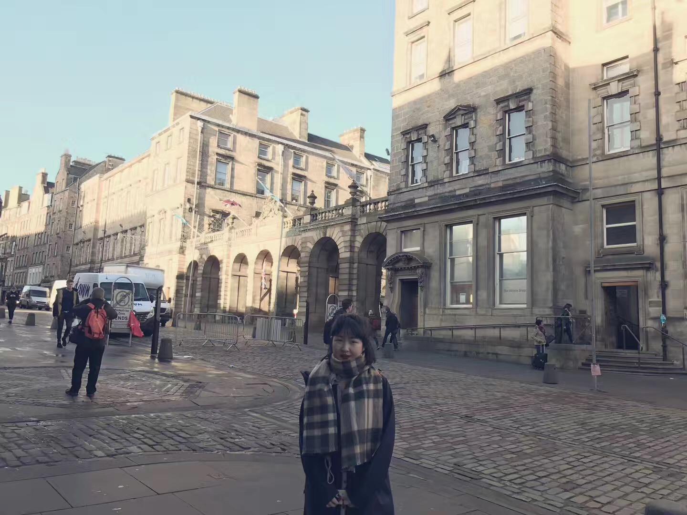

I am a postgraduate student in the University of Glasgow's
[Institute of Neuroscience and Psychology](http://www.gla.ac.uk/researchinstitutes/neurosciencepsychology/).
I work with [Prof.Benedict Jones](https://www.gla.ac.uk/researchinstitutes/neurosciencepsychology/staff/benjones/)

# Research Interest
My current work focuses on the relationship between women's face width-to-height ratio(fWHR) and sexual desire.

# Education
* Now 
MSc in Research Methods of Psychological Science, [University of Glasgow](https://www.gla.ac.uk/)
  
* 2016
BSc in Applied Psychology, [South-Central University for Nationalities](http://www.scuec.edu.cn/)

# Professional Employment
* 2016-2017
Mandarin Language Teacher, [Universiti Malaysia Pahang](http://ump.edu.my/)

# Awards & Honors

    